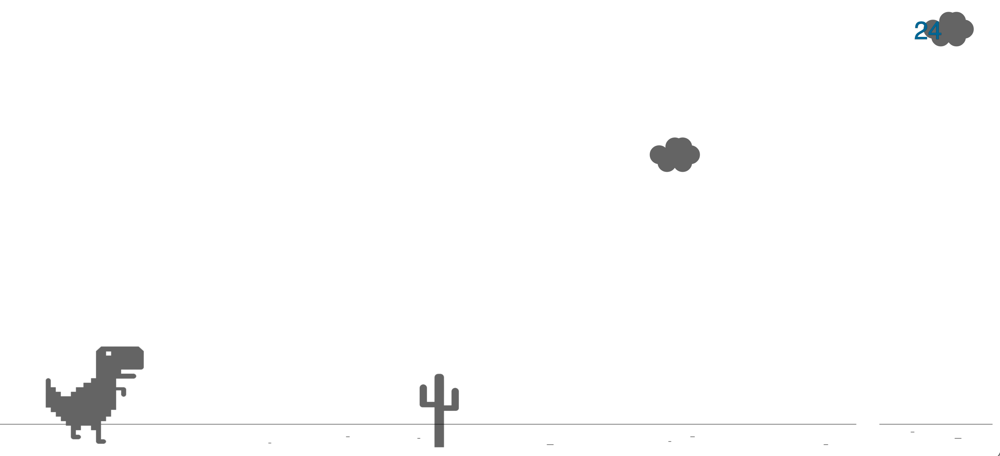

# DinoGame ==> Play [HERE](https://dino-game-paulmagos.vercel.app/)
<!-- TABLE OF CONTENTS -->

  <ol>
    <li><a href="#about-the-project">About The Project</a></li>
    <li><a href="#built-with">Built With</a></li>
    <li><a href="#contact">Contact</a></li>
  </ol>

<!-- ABOUT THE PROJECT -->
## About The Project

This is a replica of the dino game from Chrome in offline mode. I've tried this "challenge" to learn some of p5.js basics. 

### Built With
* [p5.js](https://p5js.org/)
* [Atom](https://atom.io/)

<!-- CONTACT -->
## Contact
[![LinkedIn][linkedin-shield]](https://www.linkedin.com/in/paulmathos/)

<!-- ACKNOWLEDGEMENTS -->
## Acknowledgements
* [Coding Challenge #147​: Chrome Dinosaur Game](https://www.youtube.com/watch?v=l0HoJHc-63Q) for the challenge
* [The Coding Train](https://www.youtube.com/channel/UCvjgXvBlbQiydffZU7m1_aw)

## A HUGE THANKS TO [othneildrew](https://github.com/othneildrew) FOR THIS [README TEAMPLATE](https://github.com/othneildrew/Best-README-Template)

[linkedin-shield]: https://img.shields.io/badge/-LinkedIn-black.svg?style=for-the-badge&logo=linkedin&colorB=555
